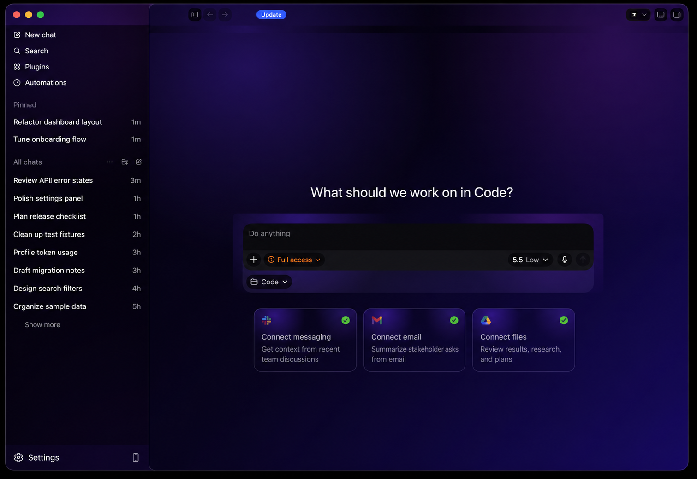

# codex-skins

Codex appearance skins plus a small public-safe screenshot generator.

## Skins

```sh
./skins/purple-gradient.sh
./skins/win98.sh
```

### Purple Gradient Preview



Sanitized DOM export: [`public-assets/codex-purple-gradient-public.dom.html`](public-assets/codex-purple-gradient-public.dom.html)

Both scripts patch `/Applications/Codex.app` by default. Pass a different app path as the first argument:

```sh
./skins/win98.sh /path/to/Codex.app
```

The scripts extract `Contents/Resources/app.asar`, inject marked CSS overrides into the main webview stylesheet, update startup styling, repack `app.asar`, update the recorded asar integrity hash, and keep the first original archive at:

```text
/Applications/Codex.app/Contents/Resources/app.asar.orig
```

## Screenshot Generator

The included FastAPI app visualizes Codex context-window usage. Use `/mock` for public screenshots; it uses deterministic sample data and does not read private transcript content.

```sh
uvicorn app:app --host 127.0.0.1 --port 8765
```

Open:

```text
http://127.0.0.1:8765/mock
```

Live private view:

```text
http://127.0.0.1:8765/
```
